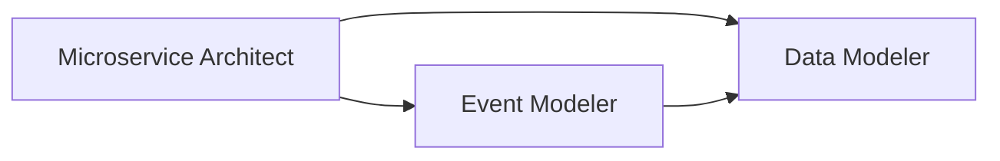
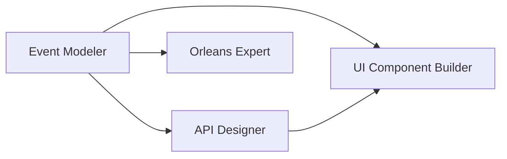
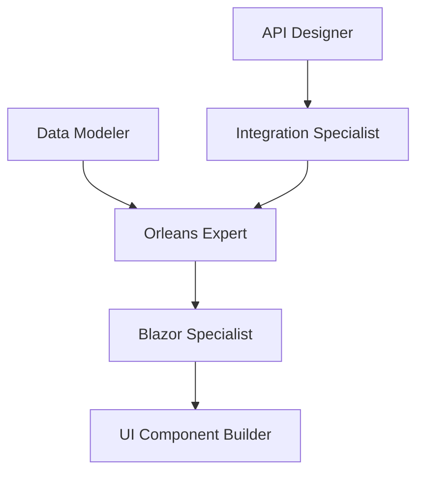
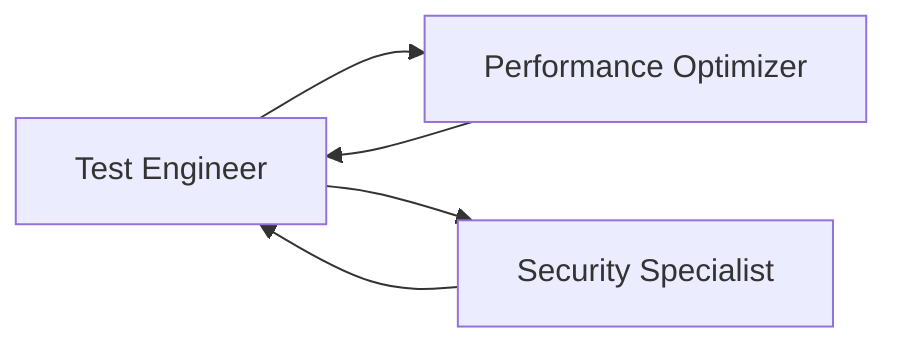
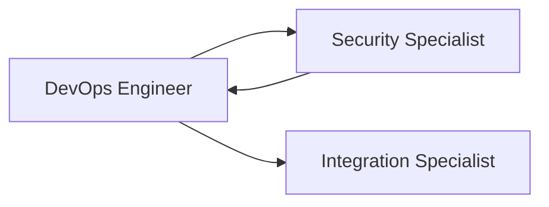
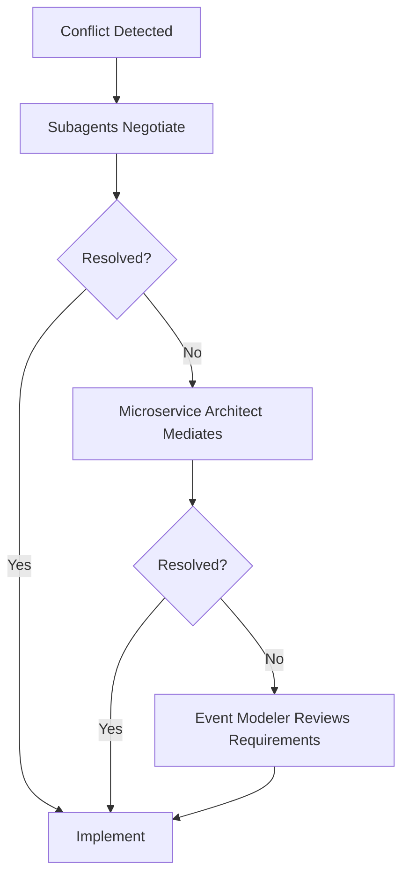
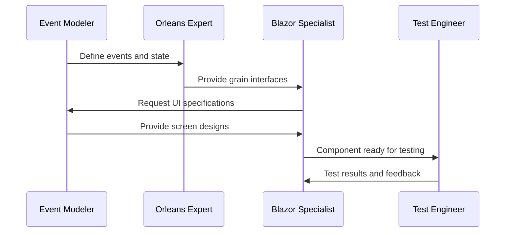
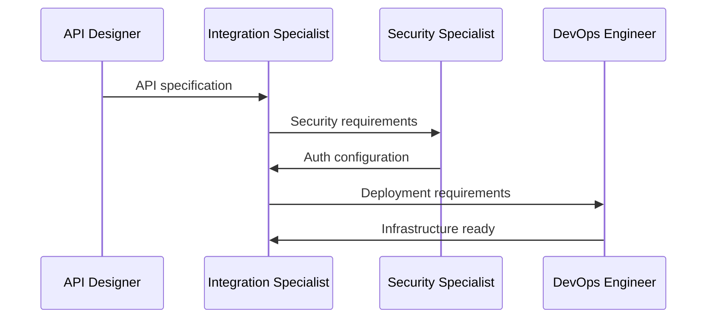
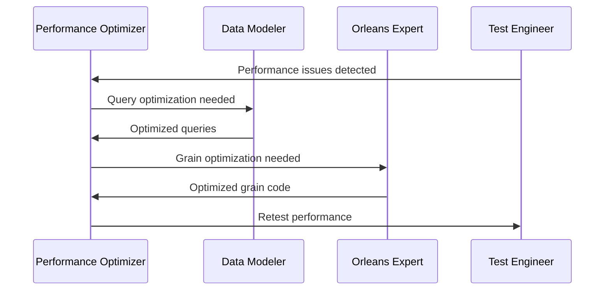
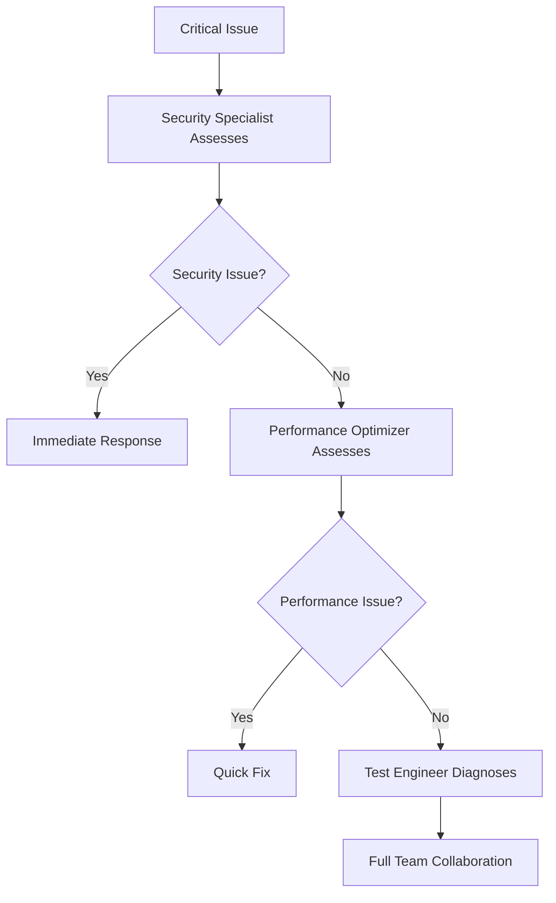

# Subagent Coordination Rules

This document defines how the 12 specialized subagents collaborate to deliver comprehensive solutions for the ForestOmni platform.

## Subagent Roster

1. **orleans-expert** - Orleans framework and distributed systems
2. **event-modeler** - Event-driven architecture and screen-first design
3. **blazor-specialist** - Blazor Server-Side and component architecture
4. **test-engineer** - Testing strategies and quality assurance
5. **performance-optimizer** - Performance tuning and optimization
6. **microservice-architect** - Microservice design and boundaries
7. **api-designer** - RESTful API design and documentation
8. **ui-component-builder** - UI components and design systems
9. **integration-specialist** - System integration and messaging
10. **data-modeler** - Database design and data modeling
11. **devops-engineer** - CI/CD and infrastructure automation
12. **security-specialist** - Security, authentication, and authorization

## Coordination Workflow

### 1. Project Initiation Phase

**Lead**: microservice-architect
**Participants**: event-modeler, data-modeler

- Microservice Architect defines service boundaries
- Event Modeler captures business events and screen flows
- Data Modeler designs initial data structures

### 2. Design Phase

**Lead**: event-modeler
**Participants**: api-designer, ui-component-builder, orleans-expert

- Event Modeler drives screen-first design
- API Designer creates API contracts from events
- UI Component Builder designs components for screens
- Orleans Expert maps events to grain behaviors

### 3. Implementation Phase

**Primary Flow**:

**Collaboration Matrix**:

| From | To | Delivers |
|------|-----|----------|
| Event Modeler | Orleans Expert | Event definitions, state transitions |
| Event Modeler | Blazor Specialist | Screen specifications, UI events |
| Orleans Expert | Data Modeler | State storage requirements |
| API Designer | Integration Specialist | API contracts for integration |
| UI Component Builder | Blazor Specialist | Reusable components |
| Data Modeler | Performance Optimizer | Query patterns, indexes |
| Security Specialist | API Designer | Authentication requirements |
| Microservice Architect | DevOps Engineer | Service dependencies |

### 4. Quality Assurance Phase

**Lead**: test-engineer
**Participants**: performance-optimizer, security-specialist

- Test Engineer coordinates testing strategy
- Performance Optimizer identifies bottlenecks
- Security Specialist validates security measures

### 5. Deployment Phase

**Lead**: devops-engineer
**Participants**: security-specialist, integration-specialist

- DevOps Engineer manages deployment pipeline
- Security Specialist configures security infrastructure
- Integration Specialist validates integration points

## Communication Protocols

### Synchronous Collaboration

Subagents collaborate synchronously when:
- Starting a new feature (Event Modeler + Orleans Expert + Blazor Specialist)
- Designing APIs (API Designer + Integration Specialist)
- Implementing security (Security Specialist + all implementation agents)
- Performance tuning (Performance Optimizer + Data Modeler + Orleans Expert)

### Asynchronous Handoffs

Subagents work asynchronously when:
- Creating reusable components (UI Component Builder → Blazor Specialist)
- Writing tests (Test Engineer ← all implementation agents)
- Setting up infrastructure (DevOps Engineer ← Microservice Architect)
- Optimizing queries (Data Modeler → Performance Optimizer)

## Decision Authority Matrix

| Decision Type | Primary Authority | Consulted | Informed |
|--------------|------------------|-----------|-----------|
| Service Boundaries | Microservice Architect | Event Modeler, Orleans Expert | All |
| Event Schema | Event Modeler | Orleans Expert, API Designer | All |
| API Design | API Designer | Integration Specialist, Security Specialist | UI Component Builder |
| Data Model | Data Modeler | Orleans Expert, Performance Optimizer | Microservice Architect |
| UI Architecture | Blazor Specialist | UI Component Builder, Event Modeler | Test Engineer |
| Security Policies | Security Specialist | API Designer, DevOps Engineer | All |
| Performance Goals | Performance Optimizer | Data Modeler, Orleans Expert | DevOps Engineer |
| Testing Strategy | Test Engineer | All implementation agents | DevOps Engineer |
| Deployment Process | DevOps Engineer | Security Specialist, Microservice Architect | All |

## Conflict Resolution

### Priority Order for Conflicts

1. **Security** (Security Specialist) - Security concerns override all others
2. **Data Integrity** (Data Modeler) - Data consistency is paramount
3. **Performance** (Performance Optimizer) - Performance within acceptable bounds
4. **User Experience** (UI Component Builder + Blazor Specialist)
5. **Developer Experience** (API Designer + Orleans Expert)

### Escalation Path

## Shared Artifacts

### Required Inputs/Outputs

Each subagent must provide:

1. **Documentation** (markdown format)
   - API specifications (API Designer)
   - Event schemas (Event Modeler)
   - Component documentation (UI Component Builder)
   - Deployment guides (DevOps Engineer)

2. **Code Patterns** (C# examples)
   - Orleans grain implementations (Orleans Expert)
   - Blazor components (Blazor Specialist)
   - Integration adapters (Integration Specialist)
   - Security implementations (Security Specialist)

3. **Test Specifications**
   - Unit test patterns (Test Engineer)
   - Performance benchmarks (Performance Optimizer)
   - Security test scenarios (Security Specialist)

4. **Configuration**
   - Infrastructure as Code (DevOps Engineer)
   - Database migrations (Data Modeler)
   - API routes and middleware (API Designer)

## Quality Gates

Each phase must pass quality gates before proceeding:

### Design Gate
- [ ] Events modeled for all screens
- [ ] API contracts defined
- [ ] Data model reviewed
- [ ] Security requirements documented

### Implementation Gate
- [ ] All tests passing
- [ ] Code coverage > 80%
- [ ] Performance benchmarks met
- [ ] Security scan passed

### Deployment Gate
- [ ] CI/CD pipeline successful
- [ ] Integration tests passed
- [ ] Load tests completed
- [ ] Security audit approved

## Collaboration Patterns

### Pattern 1: Event-Driven Feature Development

### Pattern 2: API Integration Flow

### Pattern 3: Performance Optimization Cycle

## Best Practices

### 1. Communication
- Use clear, specific terminology
- Provide code examples with explanations
- Document assumptions and constraints
- Share context about decisions

### 2. Handoffs
- Include all necessary context
- Provide working code examples
- Document edge cases
- Include test cases

### 3. Collaboration
- Request input early in the process
- Share work-in-progress for feedback
- Validate assumptions with relevant experts
- Document decisions and rationale

### 4. Quality
- Follow established patterns
- Write comprehensive tests
- Document code thoroughly
- Perform code reviews

## Continuous Improvement

### Feedback Loops

1. **Sprint Retrospectives**
   - Review collaboration effectiveness
   - Identify communication gaps
   - Adjust coordination rules

2. **Pattern Evolution**
   - Document successful patterns
   - Share learnings across subagents
   - Update best practices

3. **Metrics Tracking**
   - Measure handoff efficiency
   - Track resolution time for conflicts
   - Monitor quality gate pass rates

### Knowledge Sharing

- Regular pattern reviews
- Cross-training sessions
- Documentation updates
- Shared code libraries

## Emergency Protocols

### Critical Issue Response

### Rapid Response Team

For critical issues, form a rapid response team:
1. **Security Specialist** (if security-related)
2. **Orleans Expert** (if distributed system issue)
3. **DevOps Engineer** (for deployment/infrastructure)
4. **Test Engineer** (for validation)

## Subagent Availability

All subagents should be available for:
- Synchronous collaboration during feature development
- Asynchronous review and feedback
- Emergency response for critical issues
- Knowledge sharing and documentation

## Success Metrics

### Collaboration Effectiveness
- Time to complete features
- Number of revision cycles
- Quality gate pass rate
- Bug escape rate

### Knowledge Transfer
- Documentation completeness
- Pattern reuse rate
- Cross-team understanding
- Onboarding efficiency

## Conclusion

These coordination rules ensure efficient collaboration between all 12 subagents, delivering high-quality solutions for the ForestOmni platform. Regular review and updates of these rules ensure continuous improvement in team collaboration.